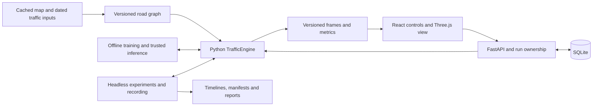

# Architecture, technical-lead review and 35-day delivery plan

Reviewed: **2026-09-23** (Asia/Singapore); repository evidence inspected on September 22–23. The original review was **PLAN** work. Scope: the React/Python application inside **`SmartFlow`** only.

**Later September 23 checkpoint:** the owner subsequently requested resumed engine implementation, then a portable project/manuscript archive. `native-3` now passes all 40 Python tests, API compilation and a three-seed synthetic headless check. Current facts below reflect that checkpoint; section 7 preserves the earlier review's historical verification separately. See [progress and handoff](PROGRESS_AND_HANDOFF.md) for implementation evidence and [project history](../PROJECT_HISTORY_AND_MIGRATION.md) for both codebases and complete old/revised chapter text. Research validation, current browser acceptance and hosting gates remain open.

The project owner reported **about 35 days remaining** during the September 22 planning discussion. That puts the provisional deadline around **2026-10-27**; the exact submission/defense date is not confirmed. This review keeps that planning anchor rather than restarting the countdown on each edit. The owner is unsure whether the panel requires RL to coordinate all intersections. This is an unresolved scope requirement, not approval to claim network-wide RL.

Navigation: [Start here](../README.md) · [Project purpose](PROJECT_OVERVIEW.md) · [Implementation evidence and handoff](PROGRESS_AND_HANDOFF.md)

**Recommendation:** continue with the custom Python engine and React/Three.js website. Make the next 35 days a completion and validation effort: finish one reproducible experiment workflow before adding features. Keep the five-junction study, separate routing from signal learning, train offline, and prepare a limited hosted demonstration with explicit run ownership. Broader coverage or coordinated RL depends on early academic confirmation and feasibility.

This preserves the agreed direction. It does not certify traffic realism or approve public deployment. The later engine work followed the owner's separate implementation request.

## 1. Problem framing and open questions

### Problem, users and critical workflow

SmartFlow must become a defensible capstone system for testing traffic signals and adaptive routes in a bounded Tagum study area. The remaining challenge is connecting partially verified engine, UI, learning and reporting components into a reliable research workflow within approximately 35 days.

Researchers need reproducible experiments; traffic/planning reviewers and panel members need understandable evidence; administrators need access control and preserved results. These audiences do not imply that each has a separately implemented account role.

The critical workflow is **select verified network → save complete inputs → run a baseline → run a compatible policy on matched demand → inspect traffic → save/replay → compare/export → explain results and assumptions**. Training supports this workflow; a training button alone is not the product outcome.

The research question is whether the tested strategies improve selected traffic outcomes under stated conditions. A positive result is not guaranteed. The system must report negative or inconclusive results honestly.

### Scope, non-goals and definition of done

The agreed scope is React, custom Python traffic logic, dynamic connected-road visualization, configurable demand/signals/disruptions, separate adaptive routing, RL signal evaluation and saved evidence. The supplied network contains five junctions, twelve road segments and twenty-four directed lanes. The minimal scene prioritizes roads, signals and a single-car demonstration; research experiments can contain many vehicles and pedestrians.

Do not spend this release on decorative scenery, a citywide road editor, a second desktop implementation, live CCTV/GPS/IoT ingestion or physical signal control. Map import does not automatically produce a calibrated traffic model.

**Provisional release assumption:** evaluate one RL-controlled junction within the connected five-junction network, with specified control at the others. This matches the current environment. It is **not yet an agreed academic requirement**. If the panel requires every junction to be adaptive or coordinated, revise the scope and plan explicitly; single-junction tests cannot satisfy it.

| Gate | Required outcome |
| --- | --- |
| Software integrity | Inputs survive create/edit/reload/run; safety and conservation hold; bad inputs cannot partially change a run; lifecycle remains consistent. |
| Complete workflow | The same saved scenario runs live/headlessly, produces a replay and exports comparable metrics from an immutable input snapshot. |
| Controller integrity | Every RL-labeled run invokes the selected compatible model; fixed-time runs are identifiable; decisions and safety overrides are distinguishable. |
| Research integrity | Observations and assumptions are separate; calibration and evaluation are separate; comparisons use matched conditions; uncertainty and unfinished demand are reported. |
| Presentation | Minimal 3D positions/turns/signals follow engine state; display caps are disclosed; the team can explain and reproduce results. |
| Release readiness | Current tests/build pass; selected hardware meets measured limits; ownership/security and backup/restore work; release and manuscript agree. |

Software tests do not establish calibration, and a successful defense demonstration does not establish readiness for physical traffic management.

### Facts, assumptions and recommendations

| Type | Item | Consequence |
| --- | --- | --- |
| User-confirmed | Remove SUMO; focus inside `SmartFlow`; pause for the review, then resume engine work and create a portable history; approximately 35 days reported. | Preserve the scope and distinguish the successive work phases. |
| Source-confirmed | FastAPI uses `simulation/traffic_engine.py`, engine ID `native-3`; React/Three.js consumes its output. | Stabilize these entry points. Older engines remain historical. |
| Source-confirmed | Backend/database support `engine_config`; omitted updates now preserve it, while React scenario types still omit it. | Server-side data loss is fixed/tested. Native editor controls and browser round-trip acceptance remain. |
| Source-confirmed | One process-local live engine; one selected RL-controlled junction. | Run ownership and coordinated network learning cannot be claimed as complete. |
| Source-confirmed | 40 test methods in five files; OSM retrieval recorded as 2026-09-21 at 14:10:12 UTC. | Test count alone is not a pass result; retrieval date is not a field-survey date. |
| Captured verification | All 40 tests passed after the engine fixes; API compilation and three-seed synthetic command passed. | Current browser/research/release acceptance remains open; see the handoff. |
| Assumption | Team can maintain Python/React and has an offline training machine. | Confirm capacity before promising dates or purchasing compute. |
| Assumption | One active operator plus authenticated viewers is sufficient initially. | A bounded hosting policy is possible, but must be enforced. |
| Recommendation | Freeze scope, start field collection immediately, and require end-to-end acceptance. | Prevent unsupported claims and late rework. |

### Questions that can change the decision

| Question | Owner / deadline | Default while unresolved |
| --- | --- | --- |
| Exact defense/submission date and earlier deliverables? | Project lead, day 1. | Approximate 35-day window ending around 2026-10-27; protect five final days. |
| One RL junction, every junction independently, or coordinated control? Which algorithms are mandatory? | Research lead with adviser/panel, by day 2. | Preserve current single-junction scope without network-wide claims; retain QL/DQL/PPO capabilities pending confirmation. |
| Which dated observations/LGU data can be obtained for the study roads? | Field-data lead, by day 2. | Synthetic scenarios stay labeled; they do not silently fulfill the actual-data objective. |
| Team availability, target hardware and hosting budget? | Project lead, by day 2. | No paid provider or performance promise; use offline training and a bounded demo. |
| Supervised demo or independent simultaneous operators? | Project lead, before hosted trial. | One active operator plus viewers; no multi-operator promise. |

Adviser question to resolve: **“Is RL control of one selected junction within a connected five-junction simulation acceptable, or must the controller optimize all junctions together? Are Q-learning, DQN and PPO all required in the final comparison?”** Record the answer in the decision log and manuscript. This report does not contact the adviser.

## 2. Options and tradeoff matrix

These assessments use the current worktree and deadline. Relative costs are planning judgments, not measured performance or hosting quotations.

| Criterion | A. Current Python engine + React website | B. Established simulator backend + existing React website | C. Installed application using the current engine |
| --- | --- | --- | --- |
| Product value | Matches the online experiment workflow and custom visual display. | Could supply richer traffic behavior while retaining the interface. | Useful offline; does not itself meet online access. |
| Delivery time | Most direct continuation; uncertainty is validation/integration. | Adds compatibility spike, conversion and retraining to the remaining month. | Adds packaging, installation and update work. |
| Implementation complexity | Own traffic physics, graph, demand, safety, routing and metrics. | Own adapters, conversion, lifecycle and capability gaps. | Retains engine risks and adds application distribution. |
| Operations | Persistent Python, web assets, storage and run ownership. | Similar needs plus external engine/runtime compatibility. | Less central demo serving, more machine-specific support; online use still needs hosting. |
| Security/data/reliability | Configuration preservation is fixed; browser acceptance, run ownership and traffic validation remain. | Same web security duties plus conversion/artifact risks. | Local files/updates require care; engine reliability is unchanged. |
| Maintainability/team fit | Fits current Python/TypeScript; requires deep traffic-model ownership. | Less internal physics ownership, more external format/build knowledge. | Extra packaging skills without removing engine work. |
| Migration/reversibility | Keep graph/scenario/frame contracts replaceable. | Feasible behind adapters, but models/results need versioning and regeneration. | Reversible as a wrapper; costly if it forks into another UI. |
| Cost now | Developer and field-validation time dominate; bounded hosting and local training remain plausible. | Integration/retraining may outweigh immediate compute savings. | Packaging/testing/support and local hardware costs. |
| Cost at plausible next scale | Independent runs increase CPU/RAM; recordings/storage and viewer bandwidth grow. Profile first. | May handle larger workloads, but no SmartFlow benchmark proves savings. | More installs increase support; later online use adds server costs anyway. |
| Disposition | **Recommended, subject to early validity gates.** | Contingency if required fidelity exceeds what the native model can deliver. | Defer unless an explicit installable/offline requirement replaces web priority. |

CityFlow is one option-B candidate: its official introduction describes microscopic traffic simulation, configurable networks/flows and a Python RL interface. This does not prove compatibility with SmartFlow's pedestrians, emergencies, map importer or deployment; a bounded spike is necessary. [CityFlow introduction](https://cityflow.readthedocs.io/en/latest/introduction.html).

### Challenge to the current proposal

1. **Removing SUMO transfers traffic-model responsibility to this project.** Passing safety tests can coexist with unrealistic junction capacity or travel times. The current entire-junction reservation for one vehicle is a concrete capacity limitation that could distort controller comparisons.
2. **Map automation was not uniquely enabled by removing SUMO.** SUMO supports native OSM import and scenario-generation tooling. The defensible rationale is implementation control and fit with the selected stack, not impossibility of connected OSM roads in SUMO. This correction does not reverse the user's removal decision. [SUMO OSM import](https://sumo.dlr.de/docs/Networks/Import/OpenStreetMap.html).
3. **RL can exploit a simulator's shortcuts.** Reward improvements require field plausibility, a fair baseline, matched demand and held-out evaluation before being interpreted as traffic improvements.
4. **The configuration contract is more urgent than another algorithm.** Server-side preservation is now fixed and tested; complete the browser editing/model-selection workflow before expanding algorithms.
5. **Existing effort does not justify ignoring failure.** If the early validity gate fails, reconsider the model or obtain an explicit scope decision. Additional visual polish cannot resolve a research blocker.

## 3. Recommendation and decision record

Continue option A. Freeze the study network and core contracts, complete the experiment workflow, and spend remaining time on verification, calibration and defense evidence. Do not start another simulator migration, desktop rewrite or general-purpose map editor without a demonstrated requirement.

Prioritize DQN/DQL as the primary neural workflow because it aligns with the previously reviewed chapter direction. Keep Q-learning as a simpler learning comparison and PPO as an available candidate. Confirm mandatory algorithms by day 2; do not silently remove a required comparison. First complete one controller end to end, then reuse that pipeline for the others.

| ID | Decision | Status | Consequence / reversal condition |
| --- | --- | --- | --- |
| D1 | Native Python; no SUMO in active serving/training. | Existing user decision. | Preserve historical evidence; reconsider only explicitly if required fidelity cannot be delivered. |
| D2 | React/Three.js website; routing separate from RL signals. | Existing user direction. | Keep boundaries stable; desktop packaging remains optional. |
| D3 | Five-junction study and minimal scenery first. | Existing direction. | Verify geographic/traffic assumptions before expansion. |
| D4 | Approximately 35-day completion plan with final buffer. | New planning recommendation based on the deadline. | Confirm exact dates; scope changes need project-lead decisions. |
| D5 | One selected RL junction as provisional scope. | **Unconfirmed academic assumption.** | Resolve by day 2; never label it coordinated network optimization. |
| D6 | One active operator, authenticated viewers, one live API process. | Proposed initial policy, not implemented assurance. | Enforce ownership and test recovery before hosting; independent concurrent runs trigger redesign. |
| D7 | Offline training; trusted versioned policies for hosted inference. | Recommendation. | Avoid live/training resource contention; cloud training requires measured need and budget. |
| D8 | Keep four working Markdown documents, plus the later owner-requested historical chapter archive. | Documentation decision updated September 23. | Put current test results in the handoff; preserve dated history and source manuscripts in the archive. |

Reversible choices include scenario parameters, UI layout, host configuration and controller selection. A changed network can be restored as a file but may invalidate models and comparisons unless snapshots survive. Schema changes and artifact removal require migration/backups. Lost observations, overwritten evidence and published unsupported claims are costly or impossible to undo; prevent them rather than relying on code rollback.

## 4. Architecture and delivery plan

### Boundaries and interfaces

Run ownership and complete versioned frame delivery in this diagram are target responsibilities, not certified existing behavior.

| Boundary | Current files | Required contract |
| --- | --- | --- |
| Core simulation | `simulation/traffic_engine.py` | Fixed steps, validated inputs, lifecycle and snapshots; independent of rendering and database access. |
| Graph/map | `simulation/road_network.py`, import/build tools | Metric coordinates, stable IDs, provenance, connected directed routes and explicit restrictions. Map refresh cannot change an existing experiment silently. |
| Inputs/demand | `simulation/scenario_config.py`, `simulation/demand.py` | Atomic validation; arrivals independent of policy/queues; separate pedestrian randomness; provenance and demand fingerprint. |
| Live application | `backend/main.py`, runtime/schemas/security modules | Authorized commands, run ownership, consistent lifecycle/errors and persistence. |
| Browser | `src/components/`, `src/api/`, `src/simulation/` | Preserve full settings, select a real model, render engine state and disclose display caps. |
| Learning | RL environment/state/reward/policy/training modules | Compatible observation/action/model contract, safe actions, correct warmup/time limits and separate evaluation. |
| Artifacts | Timeline services, playback engine, evaluator | Snapshot inputs/model provenance; reject incompatible artifacts; replay/report metrics agree. |

Keep `/api/simulation/configure`, lifecycle routes, `/ws/simulation`, `/api/visual-network`, scenario CRUD, model/training routes and run/report APIs. Prefer additive changes with round-trip tests over an API rewrite. Hosted start currently requires a saved scenario.

### Native model reference

- **Time:** `native-3`, 0.1-second steps, metres/seconds/m/s. Start/reset restores baseline constraints before replaying events. Version changes intentionally invalidate incompatible model/recording artifacts.
- **Graph:** five junctions, twelve roads, twenty-four directed lanes, covering parts of Arellano, Jose Abad Santos, Lapu-Lapu, Mabini and Osmeña streets. Assumptions include one lane per direction, 3.3 m width, 8.33 m/s study speed and experimental signals. Supplied prohibited turns are supported; actual lane/turn/signal details need field review.
- **Vehicles:** IDM-style following plus hard gaps; car, motorcycle, tricycle, bus, truck and emergency dimensions/speed factors. This does not imply lane changing, overtaking or motorcycle filtering.
- **Junctions:** exclusive reservations, signal/stop permission, downstream storage and pedestrian clearance. Simplified all-way-stop comparison exists. One-vehicle junction capacity is a modeling limitation requiring early plausibility checks.
- **Signals:** phase order/timing/offset, green limits, yellow/all-red, pedestrian service and emergency requests through safety rules. Log safety overrides separately from learned decisions.
- **Routing:** travel-time/queue costs; avoids closed/prohibited movements. Default reroute interval is 15 seconds with a 15% improvement threshold. `static` suppresses congestion rerouting but still permits closure detours.
- **Demand:** single-car replacement is a demonstration, not a matched-arrival comparison. Seeded schedules/windows and explicit trips supply experiments. Blocked arrivals wait subject to reported capacity limits; crossing distance/speed and pedestrian waiting threshold are configurable.
- **RL:** 30 observation values, five service actions, one selected junction. Metadata identifies `native-local-30-v1`, `protected-service-5-v1` and the default network fingerprint. Compatibility metadata alone does not establish artifact trust.

Custom graph JSON is supported through Python/headless paths. The hosted geometry endpoint serves the default study network; `tagum_1`, `tagum_2`, `tagum_3` are compatibility aliases, not three native networks. Older generic/SUMO engines, `services/simulation_service.py` and `sumo/` assets remain historical; avoid reconnecting them to active paths.

### Data changes and compatibility

| Data | Present state | Next requirement |
| --- | --- | --- |
| Saved scenarios | JSON `engine_config` exists in SQLite/API; frontend types omit it. | Preserve it through edits; define replacement versus partial-update semantics; test advanced fields. |
| Native config | Signal plans/control junction, vehicle mix, provenance, demand windows/trips, constraints/events, routing/crossing parameters and limits. | Validate types, finite values, IDs/ranges and unknown fields; document intentionally additive overlapping windows. |
| Legacy disruption JSON | Older structured fields coexist with presets. | Translate supported settings or reject/explain them; do not silently ignore intended inputs. |
| Graph | Versioned JSON/provenance and refresh scripts. | Retain extract, derived graph, field corrections and assumptions; never rewrite a historical run's graph. |
| Runs | New manifests include experiment/network information. | Verify immutable normalized config, seed, demand hash, duration, warmup, engine/graph versions and model ID/hash. Add model content hashing where absent. |
| Models | Compatibility checks and registered-policy resolver exist. | UI selects `ql:<id>`, `dql:<id>` or `ppo:<id>`; reject stale metadata and untrusted paths; show actual controller. |
| Recordings/comparison | Native compatibility checks and full-input comparison keys. | Distinguish a matched policy comparison from a deliberate changed-scenario/network experiment; label changed inputs explicitly. |
| Observations | Trip CSV input and a synthetic peak-event JSON example exist. | Preserve survey dates/method/units, raw observations and transformations; distinguish measured counts from inferred OD trips. |

Keep metric definitions stable: `avg_wait` is stopped time for relevant admitted vehicles; `avg_queue` is time-averaged queue per incoming lane; `max_queue` is the largest stopped lane queue; `throughput` counts completed trips in the measurement window; `avg_travel_time` uses full trip times of window completions; `avg_ped_delay` is waiting time. Include pending, dropped and unfinished demand. Audit warmup/denominators across live state, saved metrics, replay and exports.

### Operating design and cost controls

For the first trial, use one persistent API process, explicit live-run ownership, persistent SQLite/artifact storage and HTTPS. Keep substantial training separate. Redis, Kubernetes, distributed simulation and a replacement database are not justified by current demonstrated requirements.

FastAPI documents that separate worker processes normally have separate memory. Applied to this repository's singleton engine, multiple workers would create separate runtimes, not a shared simulation. This is an inference from that process model and current source. [FastAPI deployment concepts](https://fastapi.tiangolo.com/deployment/concepts/).

No hosting price can be responsibly selected without a provider, region, budget and measured workload. Measure CPU/RAM, step/frame time, recording growth and training wall time. Budget for API uptime, storage, backups, bandwidth and any approved training compute. Recording volume is approximately `recorded frames × average bytes per frame × retained runs`, adjusted using measured compression. Independent concurrent runs, rather than registered account count, are the immediate compute scaling issue.

### Small delivery slices within 35 days

For scheduling only, day 1 is September 23 and day 35 is October 27, 2026. These are calendar windows, not 35 full working days; confirm the actual deadline and availability before committing dates. Assign named teammates to the owner roles on day 1; if one person holds multiple roles, do not assume parallel capacity. Field collection begins alongside software stabilization.

| Slice / window | Useful delivered result | Owner | Dependencies | Acceptance evidence |
| --- | --- | --- | --- | --- |
| S0, days 1–2 | Confirmed academic scope, release checklist and preserved checkpoint. | Project/research + implementation lead | Adviser, deadline and team availability | Record exact deadline, RL scope, algorithms and field schedule; preserve current edits and distinguish tests from plans. |
| S1, days 1–4 | Save, edit, reload and run the exact scenario. | API/frontend owner | Current schemas/database | Complete `engine_config` round-trip; clear legacy-field behavior; invalid requests do not change prior settings. |
| S2, days 3–7 | Reproducible fixed-time run with disruption and recovery. | Engine owner | S1, frozen graph | Safety/conservation hold; closure/reopening accounts for demand; metrics/fingerprints repeat; preliminary field plausibility reviewed. |
| S3, days 6–10 | Replay and export that baseline. | API/frontend owner | S2 | Original metrics agree with replay/export; errors finalize jobs; scenario edits do not alter existing evidence. |
| S4, days 8–14 | One real DQN workflow, reused for required QL/PPO comparisons. | ML/engine owner | S2–S3, confirmed academic scope | Train/save/load/select/infer demonstrated; decision/override traces; stale-model rejection; Gym/warmup/time-limit checks. |
| S5, days 1–14 | Dated field dataset and calibration/evaluation split. | Field-data/research lead | Access, survey plan and adviser protocol | Raw counts/turns/pedestrians/queues/travel observations retained; missing data/assumptions labeled; held-out data kept separate. |
| S6, days 15–22 | Matched reproducible evaluation report. | Research + ML owner | S4–S5 | Required algorithms/scenarios, multiple seeds, paired inputs, uncertainty and unfinished demand; negative results retained. |
| S7, days 18–26 | Stable minimal 3D and limited hosted demonstration. | Frontend/deployment owner | S3–S4, bounded runtime | Current build/browser checks, faithful state, target-device performance, ownership/auth/reconnect and restore evidence. |
| S8, days 27–30 | Release candidate, manuscript alignment and rehearsal. | Project lead + owners | Required earlier gates | Fresh-machine setup, local fallback, reproducible result, backup package and no high-impact open defect. |
| Buffer, days 31–35 | Fix and rehearse only. | Project lead | Frozen candidate | No new features/architecture; resolve demonstrated defects and protect submission time. |

Decision gates: **day 2** academic scope; **day 7** native model validity; **day 14** data/controller viability; **day 22** evaluation freeze; **day 30** release-candidate freeze. A failed gate triggers an explicit project-lead/adviser decision. It does not authorize silently shrinking the research objective. Do not schedule the first complete workflow in the final five days.

## 5. Risk register with mitigations and owners

Likelihood is qualitative, not measured. Release blockers apply to the stated capstone/hosted scope.

| Risk and basis | Likelihood / impact | Mitigation and trigger | Owner |
| --- | --- | --- | --- |
| Academic RL scope unknown, confirmed by user. | High uncertainty; potential redesign. | Adviser decision by day 2. If coordination is mandatory, reassess state/action/reward and critical path immediately. | Research/project lead |
| Exclusive whole-junction reservations distort capacity. | High modeling risk; invalid conclusions. | Early discharge/queue/travel checks against observations. Model or explicitly agreed scope decision by day 7. | Engine + research |
| Native scenario UI remains incomplete. | Server preservation fixed/tested; browser editing/model selection still pending. | Complete native controls/types and create/edit/reload/run acceptance before evaluation. | API/frontend |
| Actual data arrives too late. | Unknown availability; blocks actual-data claim. | Collect now, checkpoint day 7, dataset gate day 14. Synthetic-only fallback needs explicit academic acceptance. | Field-data lead |
| RL gains reflect selected seeds, changed demand or censored trips. | Material research risk. | Held-out protocol, paired inputs, unfinished/external demand and sensitivity analysis; compare traffic outcomes beyond reward. | ML/research |
| Users control the same global run. | Confirmed design issue for concurrent operators. | Enforce owner/admin takeover rules; test two users; add independent sessions only if required. | API/deployment |
| Stream/session and expensive-job permissions are incomplete. | Observed review points; hosting gate. | WebSocket authenticates at connection but not in the send loop: test logout/expiry/revocation and define bounded revalidation. Training start/stop uses `view`: specify intended authority. Verify origins, CSRF boundaries and denied mutations. | Security/API |
| Models are stale or untrusted. | Historical artifacts present; inference/data risk. | Native contract, trusted storage, model identity/hash and rollback. Metadata compatibility is not authenticity. | ML/deployment |
| CPU/RAM/disk exhaustion from demand, jobs or recordings. | Unmeasured; demo/hosting failure. | Separate heavy jobs, enforce limits, profile, bound retention and report overflow. | Engine/deployment |
| OSM geometry is mistaken for observed traffic/signals. | Confirmed experimental assumptions; misleading claims. | Verify roads/turns/signals; retain attribution/date; label inferred values and version corrections. | Field-data/research |
| Crash, schema change or deletion loses evidence. | Possible; high recovery cost. | Coherent database/artifact backup, immutable raw observations, restore drill and interrupted-job reconciliation. | Deployment/project lead |
| Python passes are treated as full release acceptance. | 40 tests passed; browser/research/hosting gates still open. | Tie suite/build/browser and research evidence to the release checkpoint; disclose missing gates. | Implementation lead |

Hidden costs include field collection, map correction, traffic-model calibration, repeated training, retraining after graph changes, report consistency, storage, recovery drills and manuscript explanation. Removing an external dependency does not remove these obligations.

## 6. Test, rollout, rollback and monitoring plan

### Release evidence

The 40 passing tests are a software checkpoint, not proof that every acceptance condition below is covered. Add meaningful tests for demonstrated gaps as implementation continues. Keep the command, environment, source revision or worktree snapshot, result and artifact references with the release evidence.

| Gate | Verification required | Acceptance / owner |
| --- | --- | --- |
| Configuration and reproducibility | Create/edit/reload/run advanced settings; reject invalid inputs atomically; reset/repeat the same scenario and seed. | No lost fields or partial mutations; repeatable demand and result fingerprints under the same version. API/engine owner. |
| Traffic safety and progress | Dense mixed traffic, downstream blockage, closures/reopening, red/yellow/all-red, pedestrian clearance, emergency requests and stop control. | No overlapping reservations, unsafe permissions, lost vehicles or conservation error. Demonstrate progress where routes and downstream capacity permit it; explain genuine oversaturation. Engine owner. |
| Metrics | Hand-check small scenarios, warmup boundaries, completed/unfinished trip cohorts, queues, waits and external demand. | Finite values, explicit denominators and agreement among live output, saved runs, replay and reports within documented numeric precision. Engine/research owner. |
| Controllers | Short real train/save/reload/infer runs for each required algorithm; action bounds, safe transitions, selected junction, model identity and stale-artifact rejection. | The selected model actually controls the run; requested actions and applied safety overrides are separately inspectable. ML owner. |
| Research validity | Field plausibility, calibration record, held-out comparisons, repeated seeds, unfinished demand and uncertainty. | Results support only the tested conditions; software test success is not substituted for validation. Research lead. |
| Complete browser workflow | Login, scenario editing, model selection, start/pause/reset, stream disconnect/reconnect, save, replay, compare and export. Inspect turns/signals/closures and display caps. | Current build passes; no silent state divergence or misleading controller/metric label. Frontend/API owner. |
| Access and artifact safety | Two users contest a run; unauthorized commands/jobs fail; test logout, expiry/revocation, allowed origins and applicable CSRF defenses; reject untrusted model paths. | Owner/viewer/admin behavior matches the documented policy and expensive operations require intended authority. API/deployment owner. |
| Performance and recovery | Measure agreed demand, viewers and recording on target hardware; interrupt jobs/processes; restore database and artifacts. | Bounded resource use, visible failure states, recoverable evidence and recorded operating limits. Deployment owner. |
| Release package | Fresh-machine setup, reproducible experiment command, required dependencies, manuscript/figure correspondence and local fallback rehearsal. | Another teammate can reproduce the nominated result and explain its limitations. Project lead. |

**Proposed performance criteria, not measurements:** at the agreed demonstration load, sustain at least one simulated second per wall-clock second and keep the 95th percentile engine-step-plus-frame cost below the 100 ms step budget. Measure the whole run loop as well: sleeping after computation can miss real-time speed even when isolated steps are fast. Record machine specifications, active vehicles/pedestrians, viewers, recording mode, memory and browser frame rate. If the selected profile advertises 300 active vehicles, test that load; otherwise disclose the measured cap. A smaller working demonstration must not conceal an unsupported research workload.

### Evaluation protocol to settle with the adviser

Use ordinary, peak and disruption/recovery scenarios with the same frozen graph, exogenous arrivals, vehicle mix, pedestrian demand, warmup, duration and safety rules for each controller comparison. Include a credible fixed-time baseline. Use a separate static-versus-adaptive routing comparison, or a clearly labeled factorial experiment, so signal and routing effects are not confused.

Start planning with at least five held-out demand seeds per condition; this is a practical starting allocation, not a claim of statistical sufficiency. Decide repetitions from variability, available time and the agreed protocol. Use multiple training seeds when making claims about an algorithm rather than one trained artifact. Report per-run results and paired differences with an appropriate uncertainty estimate; retain failures and negative results. Do not tune on the held-out evaluation set or report only the best seed. If resources limit repetitions, state that limitation instead of overstating confidence.

Verify custom-environment behavior, separate evaluation from training, and distinguish time-limit truncation from natural termination. These checks and repeated evaluation follow the general guidance in the [Stable-Baselines3 RL tips](https://stable-baselines3.readthedocs.io/en/master/guide/rl_tips.html); they do not establish SmartFlow model validity or mandate a dependency upgrade.

### Rollout

1. **Local checkpoint:** preserve the current worktree and data, verify the latest suite, and close configuration/model-selection integrity gaps using temporary test data.
2. **Research checkpoint:** freeze graph, scenario definitions and metric semantics; retain calibration records and raw observations. Generate versioned models and evaluation artifacts from those inputs.
3. **Limited hosted trial:** one owned run, authorized viewers, HTTPS, production secrets, persistent storage, bounded jobs/recordings and tested backups. Keep training offline. Do not expose arbitrary model uploads as part of this release.
4. **Release candidate by day 30:** complete the end-to-end browser checks, target-machine load check, restore drill and defense rehearsal. Prepare a local run and a clearly labeled recorded replay as contingencies.
5. **Submission:** preserve exact source/build, dependencies, data/config/model hashes, experiment commands and manuscript figures. Use the final five days for corrections and rehearsal.

These are future gates, not a statement that deployment or field validation has happened. No deployment is authorized or performed by this planning document.

### Rollback and evidence recovery

Before schema or artifact-layout changes, stop new writes/jobs and create a coherent checkpoint of the database, recordings, models, graph and manifests. Use SQLite's supported backup mechanism or a cleanly closed database snapshot; copying an actively changing database file alone is not a recovery plan. See the [SQLite Online Backup API](https://sqlite.org/backup.html).

Test restoration in a separate location and confirm that database references resolve to the restored files and that a saved run can be replayed. Keep a last-known-working source/build and a matching data/artifact checkpoint. Revert them together when compatibility requires it; a code-only rollback may not undo a schema or model-contract change.

After a failed release, stop admission of new runs, preserve diagnostic logs and failed artifacts, restore the compatible checkpoint, and repeat a baseline/replay smoke check. Mark interrupted jobs explicitly. Do not promise exact simulation resumption after a crash unless that capability has been implemented and tested. Preserve original observations and evaluation output; do not use a broad Git reset or delete them to make the workspace appear clean. The deployment owner executes recovery; the project lead decides whether to reopen the demonstration.

### Minimal observability

| Signal | Required response | Owner |
| --- | --- | --- |
| Run ID, owner, controller/model identity, seed, input/graph/engine versions and demand fingerprint | Missing provenance makes a run ineligible for final comparison until resolved. | API/research |
| Conservation, invalid state and safety-invariant errors | Any violation blocks use of that run as research evidence; preserve diagnostics and correct the cause. | Engine |
| Step/frame cost, simulation-to-wall-time ratio, CPU/RAM and recording size | Reduce admission or revise the declared operating limit when measured limits are exceeded; never silently drop simulated demand for speed. | Deployment/engine |
| Pending, dropped, admitted, completed and unfinished demand | Separate oversaturation and configured capacity limits from defects; include these counts in reports. | Engine/research |
| Requested/applied policy actions and safety overrides | Investigate persistent suppression, incompatible models or an RL label with no policy inference. | ML |
| Stream disconnects, authorization denials and ownership conflicts | Recover UI state explicitly; investigate repeated failures without logging credentials/tokens. | API/frontend |
| Job progress/final state, disk space, backup age and restore result | Stop unsafe new work before storage exhaustion; reconcile stuck/interrupted jobs; repair stale backups. | Deployment |

Structured application logs and per-run summaries are sufficient initially. Assign actual thresholds from the target-hardware trial; a separate monitoring platform is deferred until a demonstrated operational need exists.

## 7. Files changed and verification results

The **original PLAN pass** produced this technical-lead review and aligned documentation. It performed no application implementation, training, field collection or deployment. The table and verification immediately below record that earlier pass, not the later engine work.

| File | Documentation change |
| --- | --- |
| [Architecture and delivery plan](ARCHITECTURE_AND_PLAN.md) | This eight-part review, alternatives, decision record, approximately 35-day schedule, risks and acceptance/recovery gates. |
| [README](../README.md) | Entry-point description of the review and current planning checkpoint. |
| [Project purpose and scope](PROJECT_OVERVIEW.md) | Deadline context and explicit uncertainty about required RL coverage. |
| [Progress and handoff](PROGRESS_AND_HANDOFF.md) | Originally recorded the planning pause; now updated with the later engine checkpoint. |

Documentation verification on September 23 passed: four main documents, all eight numbered review sections, valid internal file links, consistent review/deadline dates and balanced Markdown code fences. SHA-256 comparison of 133 source/dependency files against the pre-review baseline found no changed, added or missing files in that checked set. The result is also recorded in the handoff.

The repository already contained substantial uncommitted migration work. Its presence in Git status is not evidence of changes made by the original review. At that planning checkpoint, the latest combined regression was unconfirmed and the 27-method source count was not a pass result.

**Subsequent authorized implementation:** the baseline 27 tests passed, demonstrated gaps were corrected, and all 40 updated tests passed in 72.961 seconds, including short real learning smoke tests. API compilation and the three-seed headless example passed. The [handoff](PROGRESS_AND_HANDOFF.md) records changes, commands, limits and remaining gates. The later owner-requested [history archive](../PROJECT_HISTORY_AND_MIGRATION.md) preserves both manuscripts and codebase progress; this file was updated to avoid presenting fixed defects or the earlier pause as current status. No new frontend acceptance, field calibration or deployment is claimed.

## 8. Deferred decisions and triggers for revisiting them

| Deferred decision | Trigger / latest decision point | Accountable owner |
| --- | --- | --- |
| Exact submission date and mandatory RL coverage/algorithms | Adviser/project confirmation by day 2; any requirement for all-junction or coordinated RL immediately changes the plan. | Project/research lead |
| More detailed junction conflict/capacity behavior | Day-7 plausibility gate fails or observations show the simplified model cannot answer the research question. | Engine/research |
| Different simulator backend | Required fidelity cannot be delivered in time; only then run a bounded compatibility spike and make an explicit scope decision. | Technical/project lead |
| Independent simultaneous live runs | A confirmed workflow requires two operators to run separate experiments; introduce per-run ownership/state and measure resource needs before scaling workers. | API/deployment |
| Hosting provider and paid compute | Measured workload, budget and persistence requirements are available before the hosted trial. | Deployment/project lead |
| Algorithm breadth and extra tuning | Confirm QL/DQL/PPO requirements by day 2; add optional work only after the required reproducible comparison is complete. | Research/ML |
| Larger network, arbitrary map selection or road editor | Current bounded study is validated and a documented research need justifies the added scope. | Research/frontend/engine |
| Desktop installer or offline packaging | Explicit distribution/offline requirements cannot be met by the rehearsed local web setup. | Project lead |
| Database replacement, queue service or distributed training | Measured contention, independent-run concurrency or recovery needs exceed the current design. | Technical/deployment lead |
| Decorative scenery and additional visual assets | All required research and release gates pass with time remaining outside the protected buffer. | Project/frontend lead |

Maintain decisions here, project purpose in the overview, verification evidence in the handoff and startup instructions in README. A recommendation becomes an accepted scope decision only when its accountable owner records the decision; an implementation becomes accepted only when its required evidence is captured.
